# Lyra Module Dependency Map

## Actual System Architecture

```mermaid
graph TD
    %% Entry Points
    run_lyra[run_lyra.py] --> module_registry[module_registry.py]
    run_lyra --> model_config[model_config.py]
    
    %% Module Registry acts as the central coordinator
    module_registry --> fallback_llm[fallback_llm.py]
    module_registry --> extended_thinking[extended_thinking.py]
    module_registry --> boredom[boredom.py]
    module_registry --> boredom_integration[boredom_integration.py]
    module_registry --> emotional_core[emotional_core.py]
    module_registry --> metacognition[metacognition.py]
    module_registry --> deep_memory[deep_memory.py]
    module_registry --> code_auditing[code_auditing.py]
    module_registry --> thinking_integration[thinking_integration.py]
    module_registry --> cognitive_integration[cognitive_integration.py]
    module_registry --> voice_interface[voice_interface.py]
    
    %% Cognitive System Dependencies
    cognitive_integration --> metacognition
    cognitive_integration --> emotional_core
    cognitive_model_integration[cognitive_model_integration.py] --> metacognition
    cognitive_model_integration --> deep_memory
    cognitive_model_integration --> emotional_core
    cognitive_model_integration --> cognitive_integration
    
    %% UI System
    lyra_ui[lyra_ui.py] --> model_config
    lyra_ui --> lyra_bot[lyra_bot.py]
    lyra_ui --> telegram_bot[telegram_bot.py]
    lyra_ui --> extended_thinking
    
    ui_main[ui/main.py] --> ui_components[ui/components/*]
    
    %% Voice and Interaction
    voice_interface --> whisper_recognition[whisper_recognition.py]
    persistent_module[persistent_module.py] --> core_proxy[core_proxy.py]
    telegram_bot --> fallback_llm
    telegram_bot --> model_backends[model_backends/phi_backend.py]
    
    %% UI Components
    ui_components --> chat_tab[chat_tab.py]
    ui_components --> image_tab[image_tab.py]
    ui_components --> voice_tab[voice_tab.py]
    ui_components --> video_tab[video_tab.py]
    ui_components --> model_tab[model_tab.py]
    ui_components --> memory_tab[memory_tab.py]
    
    %% Style definitions
    classDef entry fill:#f9f,stroke:#333,stroke-width:2px;
    classDef cognitive fill:#bbf,stroke:#333,stroke-width:1px;
    classDef io fill:#bfb,stroke:#333,stroke-width:1px;
    classDef ui fill:#fbf,stroke:#333,stroke-width:1px;
    
    %% Apply styles
    class run_lyra,module_registry entry;
    class emotional_core,metacognition,cognitive_integration,cognitive_model_integration,deep_memory,thinking_integration,extended_thinking cognitive;
    class voice_interface,persistent_module io;
    class lyra_ui,ui_main,ui_components ui;
```

## Key System Components

### Entry Points
- **run_lyra.py**: Main application entry point
- **module_registry.py**: Central coordinator that loads and initializes all modules

### Cognitive System
- **emotional_core.py**: Emotion modeling with various components:
  - EmotionalState, EmotionalResponseGenerator, EmotionalMemory, EmotionalCore
- **metacognition.py**: Self-awareness components:
  - ConceptNode, ConceptualNetwork, Goal, GoalManager, MetacognitionModule
- **thinking_integration.py**: Thought processing
- **extended_thinking.py**: Enhanced reasoning capabilities
- **deep_memory.py**: Long-term memory management

### Interface Components
- **telegram_bot.py**: Telegram interface (LyraTelegramBot)
- **lyra_ui.py**: Main UI orchestrator (LyraUI)
- **voice_interface.py**: Voice capability manager (VoiceInterface)

### UI Implementation
- **ui/main.py**: Main UI class (LyraUI)
- **ui/components/**: Tab-based UI components inheriting from TabComponent

### System Utilities
- **persistent_module.py**: System tray application (LyraSystemTray)
- **core_proxy.py**: Proxy for core communications

## File Loading Sequence

1. `run_lyra.py` starts execution
2. It initializes the module registry through `module_registry.initialize_all_modules()`
3. Module registry loads modules in dependency order
4. UI components are initialized based on configuration

## Service Integration

The system supports multiple interfaces:
- Web UI via `lyra_ui.py`
- Telegram via `telegram_bot.py`
- Voice via `voice_interface.py`
- System tray via `persistent_module.py`

These components operate independently but can be orchestrated through the module registry.

## Noted Duplications and Deprecated Components

- UI implementations appear in both `lyra_ui.py` and `ui/main.py` with overlapping functionality
- Some components in `src/lyra/` may be newer implementations or duplicates of modules in `modules/`
- `io_manager.py` appears to be a newer component that may replace some functionality in other modules